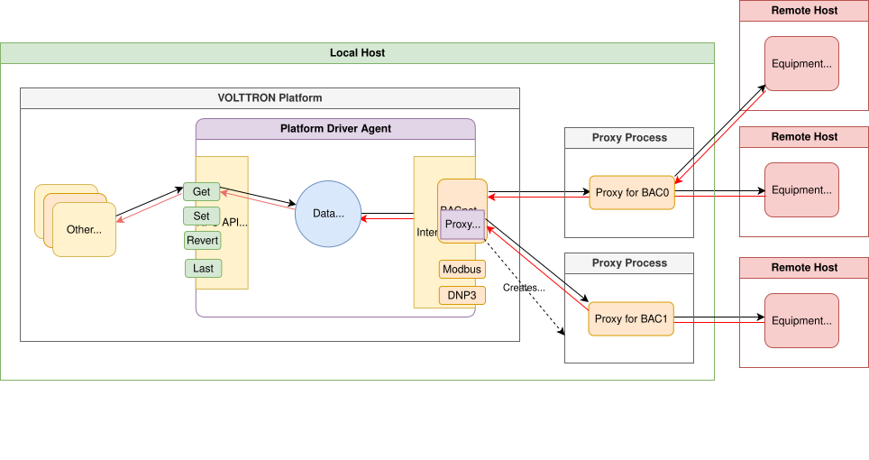

.. _BACnet-Driver:

=============
BACnet Driver
=============
The BACnet driver interface enables the ability for the platform driver to communicate with BACnet devices.
Communication with devices is handled by a helper process referred to as a BACnet proxy. The BACnet interface will
automatically manage one or more proxy processes, spinning them up as needed to handle communication with distinct
BACnet networks. One proxy will be created for each specified combination of `local_interface`
and `bacnet_port`.

.. note::
    Versions of the BACnet driver prior to VOLTTRON 11.1 used a separate BACnet Proxy Agent to act as the local BACnet
    device for communication on the network. This is no longer necessary as the driver now automatically spins up one
    or more proxy processes as needed. Note that the `local_interface`and `bacnet_port` settings were previously
    configured as the address and port for the BACnet Proxy Agent. While the default settings will work for most
    installations, if you have multiple BACnet networks or need to specify a particular local address,
    this may now be configured in the settings for each device.

BACnet Driver Configuration
===========================

Installation
------------

The BACnet driver interface can be enabled by installing `volttron-lib-bacnet-driver` library using vctl:

.. code-block:: bash

    vctl install-lib volttron-lib-bacnet-driver

.. _BACnet-Configuration-File:

Configuration
-------------

For BACnet devcies, the `driver_config` section of the device configuration file accepts the following arguments:

    - **target_address** (alias: "device_address") - Address of the device.  If the target device is behind an
      IP to MS/TP router then Remote Station addressing will probably be needed for the driver to find the device.
    - **device_id** - BACnet Object ID of the device.  Used to establish a route to the device at startup
    - **min_priority** - (Optional) Minimum priority value allowed for this device whether specifying the priority
      manually or via the registry config.  Violating this parameter either in the configuration or when writing to the
      point will result in an error.  Defaults to 8
    - **max_per_request** - (Optional) The largest number of objects the driver will attempt to transfer, per request.
      This setting is primarily for polling low resource devices that do not support segmentation. Defaults to 10000
    - **ping_retry_interval** - (Optional) The driver will ping the device to establish a route at startup. If the
      device is not reachable, the driver will retry the ping at this interval until it succeeds. Defaults to 5 seconds.
    - **use_read_multiple** - (Optional) By default, the driver will use the ReadPropertyMultiple service to get data
      from the device, but will fall back to looping over the points using the ReadProperty service.
      Setting this parameter to false will force the use of single ReadProperty requests. Be aware that setting this
      to false will cause polls to take much longer. Only change if needed. (Defaults to true.)
    - **cov_lifetime** - (Optional) When a device establishes a change of value subscription for a point, this argument
      will be used to determine the lifetime and renewal period for the subscription, in seconds. (Defaults to 180.)
    - **timeout** - (Optional) The number of seconds to wait for a response from the device before
      considering the request failed. (Defaults to 30 seconds.)
    - **local_device_interface** - (Optional) The IP interface on which the local BACnet device should be bound.
      The interface will typically be specified in CIDR notation (e.g., 192.168.1.0/24). By default, the driver
      will attempt to discover the correct interface, but this can only succeed if the device is discoverable.
    - **bacnet_port** - (Optional) The BACnet port number of the local BACnet device. By convention, BACnet ports are
      numbered from 0 --- which corresponds to UDP port 47808 (0xBAC0), while 1 corresponds to 47809 (0xBAC1), etc.
      (Defaults to 0)

Here is an example device configuration file:

.. code-block:: json

    {
        "driver_config": {"device_address": "10.1.1.3",
                          "device_id": 500,
                          "min_priority": 10,
                          "max_per_request": 24
                          },
        "driver_type": "bacnet",
        "registry_config":"config://registry_configs/vav.csv",
        "interval": 5,
        "timezone": "UTC",
        "heart_beat_point": "heartbeat"
    }

A sample BACnet configuration file can be found `here <https://raw.githubusercontent.com/eclipse-volttron/volttron-lib-bacnet-driver/main/bacnet.config>`_ or
in the volttron-lib-bacnet-driver repository.

.. _BACnet-Registry-Configuration-File:

BACnet Registry Configuration File
----------------------------------

The registry configurations may be defined using CSV or JSON files, wherein each record (row for CSV, object for JSON)
configures a point on the device. Keys (columns for CSV) may be specified in snake case (e.g., volttron_point_name)
or using Title Case (e.g., (Volttron Point Name").

..
    #    Most of the configuration file can be generated with the `grab_bacnet_config.py` utility in `scripts/bacnet`. See
    #    :ref:`BACnet Auto-Configuration <BACnet-Auto-Configuration>`.

The following attributes are required for each record:

    - **volttron_point_name** - The name by which the platform and agents running on the platform will refer to this
      point.
    - **units** - The unit of the data. Included in publishes as meta data and used by the historian.
    - **bacnet_object_type** - A string representing the type of BACnet object the point is.
      This may be specified in a hyphenated format (e.g., analog-input) or lower camelCase: (e.g., analog-input).
      Examples include:

        * analog-input
        * analog-output
        * analog-value
        * binary-input
        * binary-output
        * binary-value
        * multi-state-value

    - **property** - A string representing the name of the property belonging to the object.  Usually, this will be
      `present-value`.
    - **writable** - Either `TRUE` or `FALSE`.  Determines if the point can be written to.  Only points labeled `TRUE`
      can be written to through the Actuator Agent.  Points labeled `TRUE` incorrectly will cause an error to be
      returned when an agent attempts to write to the point.
    - **instance** - The instance number of the BACnet object.

The following columns are optional:

    - **array_index** - If the property being accessed is an array, this is the index within the array.
      If the property is not an array, this column may be omitted or left blank.
    - **Write Priority** - BACnet priority for writing to this point.  Valid values are 1-16.  Missing this column or
      leaving the column blank will use the default priority of 16
    - **COV Flag** - Either `True` or `False`.  Determines if a BACnet Change-of-Value subscription should be
      established for this point.  Missing this column or leaving the column blank will result in no change of value
      subscriptions being established.

Any additional columns will be ignored. It is common practice to include a `point_name` or `reference_point_name`
column to include the device documentation's name for the point and `notes` and `unit_details` columns for additional
information about a point.

.. csv-table:: BACnet
        :header: Point Name,Volttron Point Name,Units,Unit Details,BACnet Object Type,Property,Writable,Instance,Notes

        Building/FCB.Local Application.PH-T,PreheatTemperature,degreesFahrenheit,-50.00 to 250.00,analog-input,present-value,FALSE,3000119,Resolution: 0.1
        Building/FCB.Local Application.RA-T,ReturnAirTemperature,degreesFahrenheit,-50.00 to 250.00,analog-input,present-value,FALSE,3000120,Resolution: 0.1
        Building/FCB.Local Application.RA-H,ReturnAirHumidity,percentRelativeHumidity,0.00 to 100.00,analog-input,present-value,FALSE,3000124,Resolution: 0.1
        Building/FCB.Local Application.CLG-O,CoolingValveOutputCommand,percent,0.00 to 100.00 (default 0.0),analogOutput,present-value,TRUE,3000107,Resolution: 0.1
        Building/FCB.Local Application.MAD-O,MixedAirDamperOutputCommand,percent,0.00 to 100.00 (default 0.0),analogOutput,present-value,TRUE,3000110,Resolution: 0.1
        Building/FCB.Local Application.PH-O,PreheatValveOutputCommand,percent,0.00 to 100.00 (default 0.0),analogOutput,present-value,TRUE,3000111,Resolution: 0.1
        Building/FCB.Local Application.RH-O,ReheatValveOutputCommand,percent,0.00 to 100.00 (default 0.0),analogOutput,present-value,TRUE,3000112,Resolution: 0.1
        Building/FCB.Local Application.SF-O,SupplyFanSpeedOutputCommand,percent,0.00 to 100.00 (default 0.0),analogOutput,present-value,TRUE,3000113,Resolution: 0.1

A sample BACnet registry file can be found `here <https://raw.githubusercontent.com/eclipse-volttron/volttron-lib-bacnet-driver/main/bacnet.csv>`_ or
in the volttron-lib-bacnet-driver repository.
